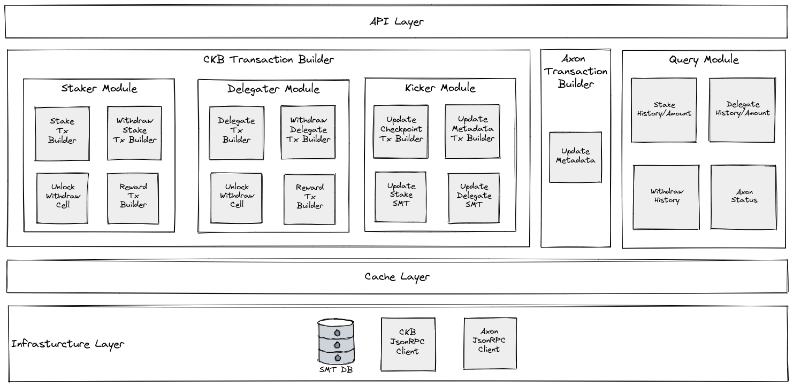
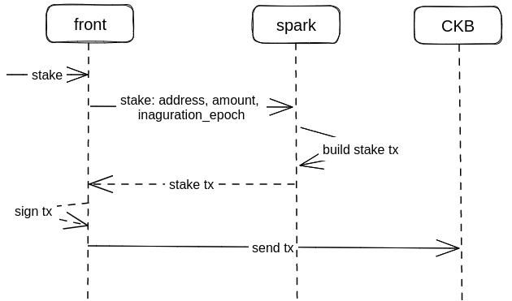

# Spark
Spark plays a crucial role in implementing the stake and delegate functions of Axon.  
It is responsible for the following tasks:  
- Constructing CKB transactions to implement Axon’s staking mechanism. The related code can be found in the `tx-builder` directory.  
- Providing query APIs for Axon’s frontend to display information to end users, including details such as stake, delegate, and reward history of users. The related code can be found in the `rpc-client` directory.  
- Recovering Sparse Merkle Trees (SMTs).  

The corresponding architecture is depicted below.

To learn more about Axon’s staking and kicker, please visit [staking protocol](https://docs.axonweb3.io/staking/staking-protocol).  
We will provide details for each of these three tasks in the sections below.  

# CKB Transaction Construction
Transaction construction can be divided into three categories:

## Staker Related Transactions
These transactions are initiated by stakers who are responsible for paying the gas fees. Examples include increasing or decreasing a staker’s stake.  

## Delegator Related Transactions
These transactions are initiated by delegators who are responsible for paying the gas fees. Examples include increasing or decreasing a delegator’s delegation to a staker.  

## Kicker Related Transactions
Within the Axon ecosystem, kicker plays a versatile, permissionless role, taking charge of the following critical tasks:  

- Monitoring the liveness of any Axon-based chain and promptly reporting its status (aka., checkpoint) to Layer 1.
- Facilitating the selection for the upcoming set of validators (aka., metadata) when the previous tenure concludes.
- Ensuring the accuracy and timeliness of the information regarding the latest staking and delegating allocations.

These functions need to be implemented by constructing corresponding transactions.  

## Workflow
For transactions initiated by a staker or delegator, the process must be started by Axon’s frontend (aka `front` in the following picture), built by spark, and finally executed in CKB.  
Here is the entire workflow:  
  
Please note that the workflow described above is specific to the processes mentioned earlier. Transactions initiated by kickers, such as checkpoint submissions and metadata updates to CKB, do not entail interactions between the `frontend` and `spark`.  

# Query
Information obtained via query APIs falls into two categories:

## Individual Staker or Delegator
- The stake, delegate, reward transaction history of a staker or delegator
- The total stake or delegate amount
- ...
## Axon Chain
- Total stake, delegate amount
- Epoch, period, block number
- Top stake address
- ...

# SMT Recovery
To run a kicker, one must query CKB and an existing kicker to recover the necessary SMTs, which are essential for constructing various types of transactions.
